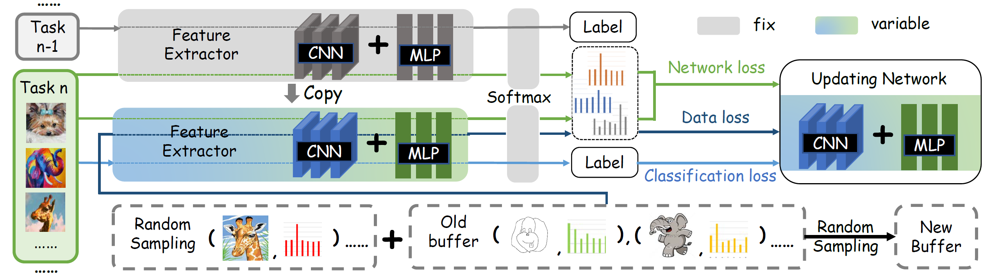

## The project is the code for "CLUE: Consolidating Learned and Undergoing Experience in Domain-Incremental Classification (ACCV2022)"

**please click [Link]() to view the full paper**

**The Framework of CLUE**

**How to Install The Enviroment**

    conda create -n crossdomain python==3.8
    conda activate crossdomain
    pip install --upgrade pip
    pip install torch==1.9.0+cu111 torchvision==0.10.0+cu111 -f https://download.pytorch.org/whl/torch_stable.html
    pip install avalanche-lib

**How to load the dataset**

Please download the dataset from the [link](https://drive.google.com/file/d/1i0yOiA7heVDI31IRIvfQcnKB5Yhs8ryN/view?usp=sharing)

    tar -xvf data.tar

**How to run the experiments**

    python main.py --dataset digits --method CLUE --epochs 20 --batch_size 128 --output res/clue_digits.log

**Reference and Acknowledgement**

[1] Pytorch: [website](https://pytorch.org/)

[2] Avalanche: [website](https://avalanche.continualai.org/)
